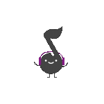

  

<h2 align="center"> Think it. Design it. Make it. </h2>

### The Logic
> I try to build beutiful systems.
> Currently locking in at 42, working with C and Python.

  

---

### Essentials
> Simple, scalable, and coordinated.
> Every detail exists for a reason.

---

### Vibe Check
> Calm, music, and the little things.

  

---

### Progress

  

