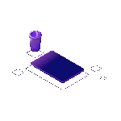

  

<h2 align="center"> Think it. Design it. Make it. </h2>

  
  
  
  

---

### /* The Logic */
> I try to build systems as beautiful as old architecture.
> Currently locking in at 42, working with C and Python.

### /* Essentials */
> Simple, scalable, and coordinated. 
> Every detail exists for a reason.

---

### // The Grid

  

  

